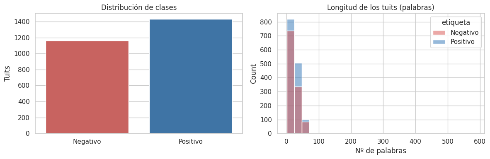
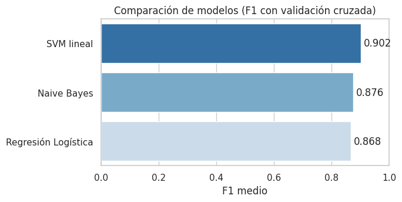
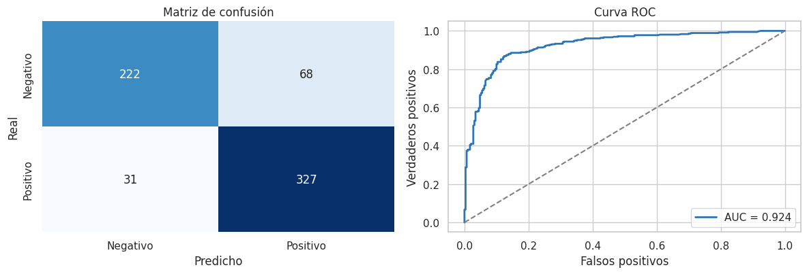
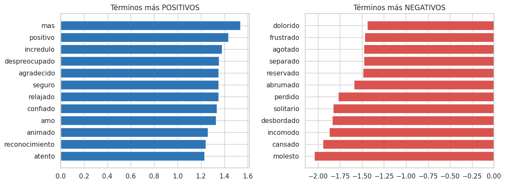

# 🗣️ Análisis de Sentimiento en Tweets en Español (NLP)

Clasificador de sentimiento (positivo / negativo) para **tuits en español**, de extremo a
extremo con **scikit-learn**: desde la limpieza del texto hasta la interpretabilidad del modelo.

> **Karen Chuquimia** · Ciencia de Datos / NLP

  

---

## 📦 Datos

Dataset de **~2.590 tuits en español** etiquetados con emociones. Las 6 categorías de la
columna `sentiment` se agrupan en sentimiento binario:

- **Positivo (1):** peaceful · powerful · joyful
- **Negativo (0):** mad · sad · scared

> El dataset no se incluye en el repo (ver `data/LEEME.md`). Si falta, el notebook genera un
> pequeño corpus de demostración para poder ejecutarse igual.

## 🧪 Pipeline

1. **EDA** — distribución de clases y longitud de los tuits.
2. **Preprocesamiento** — se eliminan URLs y menciones (@usuario), tildes y *stopwords*,
   **conservando las negaciones** (clave en sentimiento).
3. **Vectorización** — TF-IDF (unigramas + bigramas).
4. **Modelado** — Regresión Logística · Naive Bayes · SVM lineal (validación cruzada).
5. **Evaluación** — accuracy, F1, matriz de confusión, curva ROC.
6. **Interpretabilidad** — términos que más empujan hacia cada clase.

## 📊 Resultados (datos reales)

- **SVM lineal:** mejor F1 en validación cruzada (**0,90**).
- **Regresión Logística** (elegida por sus probabilidades e interpretabilidad):
  **Accuracy 0,85 · F1 0,87 · ROC-AUC 0,924**.

**Distribución de clases y longitud de los tuits**


**Comparación de modelos (F1, validación cruzada)**


**Matriz de confusión y curva ROC**


**Términos más decisivos (interpretabilidad)**


## ▶️ Cómo ejecutar

```bash
pip install -r requirements.txt
jupyter notebook notebooks/analisis_sentimiento_es.ipynb
```

## 🚀 Próximos pasos

- Clasificación **multiclase** de las 6 emociones originales.
- Probar **Transformers en español** (BETO, RoBERTa-es).
- **Desplegar** como API (FastAPI) o app interactiva (Streamlit).

## 🛠️ Stack

`Python` · `scikit-learn` · `Pandas` · `NumPy` · `Matplotlib` · `Seaborn`

## 📁 Estructura

```
Proyecto_NLP_Sentimiento_ES/
├── README.md
├── requirements.txt
├── .gitignore
├── data/
│   ├── LEEME.md                 # cómo obtener el dataset
│   └── descargar_dataset.py     # descarga alternativa (muchocine)
├── graficos/                    # visualizaciones del análisis
└── notebooks/
    └── analisis_sentimiento_es.ipynb
```
